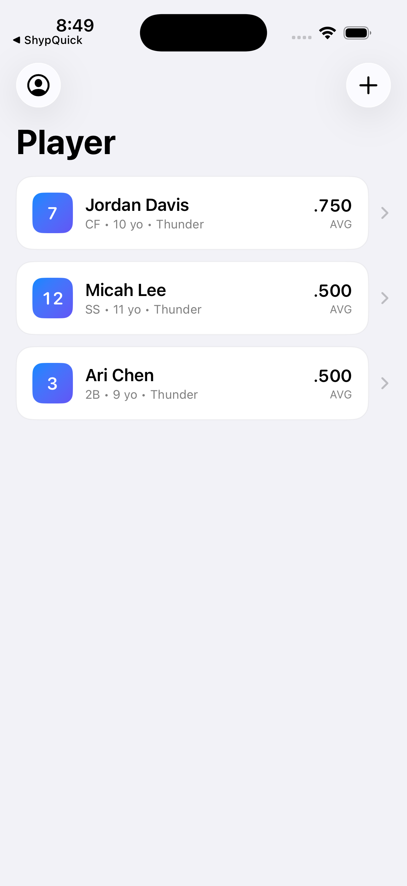
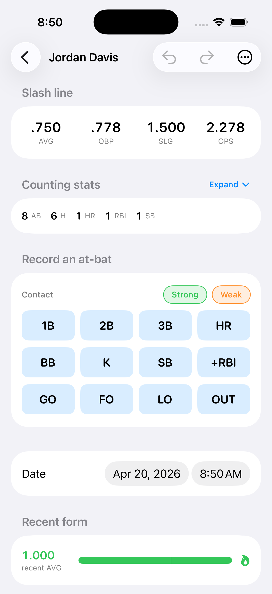
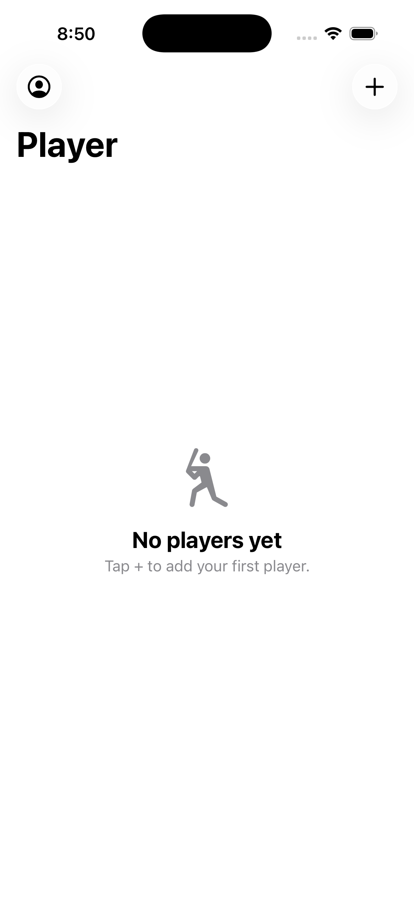

<div align="center">


# Tap. Track. Done.

**The no-nonsense baseball stat tracker for parents and coaches.** Log at-bats
between pitches, get real slash lines instantly, and never argue about who was
up last inning.


</div>

---

## Why

Every baseball parent has tried to score a game on the back of a program or
in the Notes app. Neither works past the third inning. Baseball Stat Tracker
is a one-tap-per-outcome logger that gives you real AVG / OBP / SLG / OPS
without spreadsheet math — built by a parent, for the kind of Saturday game
where you're holding a coffee in one hand.

## Features

- **One tap per at-bat** — 12 outcome buttons cover every line of the
  scorebook (1B/2B/3B/HR, BB, K, GO/FO/LO, OUT, SB, +RBI).
- **Slash line in real time** — AVG, OBP, SLG, OPS update the moment you tap.
- **Per-day game log** — every at-bat, timestamped, groupable by game day,
  with a rolling "recent form" meter so streaks and slumps are obvious.
- **Contact quality** — optional Strong/Weak tag on any batted ball so you
  can separate hard contact from fortunate hits.
- **Undo / redo** — full history stack for when the scoring hand gets
  happy. Swipe-to-delete any row in the game log.
- **Offline-first** — every byte lives on the device; no server, no account,
  no ads, nothing leaves the phone unless you sign in with Apple to sync a
  session across reinstalls.
- **Sign in with Apple + local email fallback** — both supported, both
  private, both survive a reinstall via Keychain.

## Screenshots

<table>
  <tr>
    <td align="center"><br/><sub>Roster with live slash lines</sub></td>
    <td align="center"><br/><sub>At-bat pad + stat grid</sub></td>
    <td align="center"><br/><sub>First-run empty state</sub></td>
  </tr>
</table>

## Tech stack

- **SwiftUI** — every screen, including the auth flow and the at-bat pad.
- **iOS 17+** — `ContentUnavailableView`, `NavigationStack`, modern
  `@Observable`-adjacent stores.
- **Sign in with Apple** via `AuthenticationServices`.
- **Local persistence** — JSON documents in the app's Documents directory,
  debounced saves, ISO-8601 dates.
- **iOS Keychain** — credentials + session survive reinstall on the same
  device; sign out is the only way to end a session.
- **No external packages.** Pure Apple frameworks.
- **xcodegen** + a shell pipeline to ship every `main` commit straight to
  TestFlight (see [`INSTRUCTIONS.md`](INSTRUCTIONS.md)).

## Build

```bash
brew install xcodegen            # one-time
xcodegen generate
open BaseballStatTracker.xcodeproj
```

Hit ⌘R. Deployment target is iOS 17. No Cocoapods, no SwiftPM packages,
nothing to fetch.

### Demo mode

The app ships with a DEBUG-only `-demoSeed` launch argument used to capture
the screenshots above. It signs in a local demo user and pre-populates a
three-player roster with a few days of at-bats:

```bash
xcrun simctl launch booted com.divinedavis.BaseballStatTracker \
    -demoSeed              # seed roster + sign in
xcrun simctl launch booted com.divinedavis.BaseballStatTracker \
    -demoSeed -demoOpenDetail   # also push into the first player's detail
```

The flag is compiled out of Release builds (`#if DEBUG`), so nothing ships
to TestFlight or the App Store.

## Ship to TestFlight

Every push to `main` ships a new TestFlight build:

```bash
./scripts/ship-to-testflight.sh --auto-notes
```

The script bumps `CURRENT_PROJECT_VERSION`, regenerates the Xcode project,
archives + exports + uploads the `.ipa`, polls App Store Connect until the
build reaches `VALID`, sets the release notes from recent commit messages,
and records the shipped commit so re-runs no-op on an unchanged tree.

See [`INSTRUCTIONS.md`](INSTRUCTIONS.md) for credential setup.

## Project layout

```
BaseballStatTracker/
├── Models/          # Player, AtBatEntry, PlayerStats (pure value types)
├── Stores/          # PlayerStore, AuthStore, UndoHistory, KeychainStore
├── Views/           # RootView, AuthView, AddPlayerView, PlayerDetailView
├── Assets.xcassets/ # AppIcon (1024×1024 single-source) + accent color
└── DemoSeeder.swift # DEBUG-only demo data for README screenshots
scripts/
├── ship-to-testflight.sh       # one-command ship
├── asc_set_whats_new.py        # poll ASC, set "What to Test"
└── asc_attach_build.py         # link latest build to App Store version
```

## Contributing

Issues and PRs welcome. The project is deliberately small — if you want to
add something bigger than a bug fix, open an issue first so we can talk
about whether it fits the "tap, track, done" philosophy.

## License

[MIT](LICENSE) — do whatever you want, just don't blame me if the scoring
gets your kid a bad reputation.
