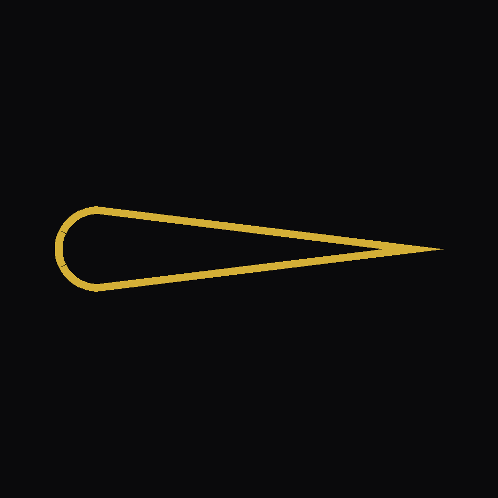

# BARREL

**Find the sweet spot.** One-tap at-bat logger for coaches, parents, and
players. Live AVG / OBP / SLG / OPS, offline, no account, no noise.

---

## Why

Every baseball parent has tried to score a game on the back of a program or
in the Notes app. Neither works past the third inning. BARREL is a
one-tap-per-outcome logger that gives you real AVG / OBP / SLG / OPS without
spreadsheet math — built by a parent, for the kind of Saturday game where
you're holding a coffee in one hand.

## Features

- **One tap per at-bat** — 12 outcome buttons cover every line of the
  scorebook (1B/2B/3B/HR, BB, K, GO/LO, SB, ROE, BU, +RBI).
- **Slash line in real time** — AVG, OBP, SLG, OPS update the moment you tap.
- **Per-day game log** — every at-bat, timestamped, groupable by game day,
  with a rolling "recent form" meter so streaks and slumps are obvious.
- **Contact quality** — optional Strong/Weak tag on any batted ball so you
  can separate hard contact from fortunate hits.
- **Undo / redo** — full history stack for when the scoring hand gets happy.
  Swipe-to-delete any row in the game log.
- **Offline-first** — every byte lives on the device; no server, no account,
  no ads, nothing leaves the phone unless you sign in with Apple to sync a
  session across reinstalls.
- **Sign in with Apple + local email fallback** — both supported, both
  private, both survive a reinstall via Keychain.
- **Night icon** — alternate gold-on-gold app icon automatically swaps in
  between 8 PM and 6 AM ET.

## Tech stack

- **Swift 5.9 + SwiftUI** — every screen, including the auth splash, the
  at-bat pad, and the animated gold wave background.
- **iOS 17+** — `ContentUnavailableView`, `NavigationStack`, `TimelineView`
  for the liquid gradient animation, `@Observable`-adjacent stores.
- **Sign in with Apple** via `AuthenticationServices`.
- **Local persistence** — JSON documents in the app's Documents directory,
  debounced saves, ISO-8601 dates.
- **iOS Keychain** — credentials + session survive reinstall on the same
  device; sign out is the only way to end a session.
- **Alternate app icons** — `UIApplication.setAlternateIconName` + a
  time-of-day scheduler drive the night-icon swap.
- **No external packages.** Pure Apple frameworks — zero SwiftPM / CocoaPods
  dependencies.
- **xcodegen** for the project spec, a shell ship pipeline for TestFlight
  (see [`INSTRUCTIONS.md`](INSTRUCTIONS.md)).

## Install

BARREL is currently in **TestFlight**. The App Store submission is in
review; once it's approved the listing will go live. In the meantime the
repo is primarily for the authors — public for transparency, not for
community builds.

## License

[MIT](LICENSE) — do whatever you want, just don't blame me if the scoring
gets your kid a bad reputation.
